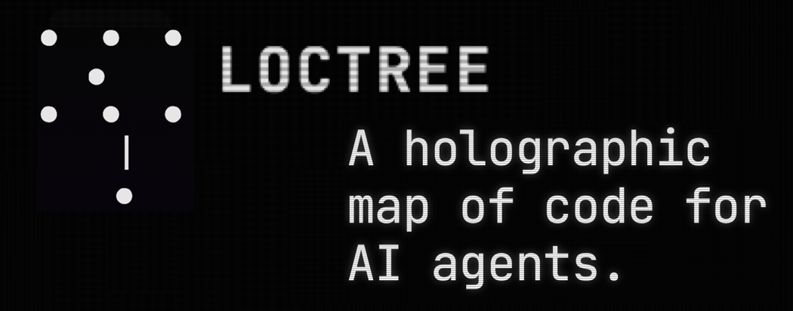
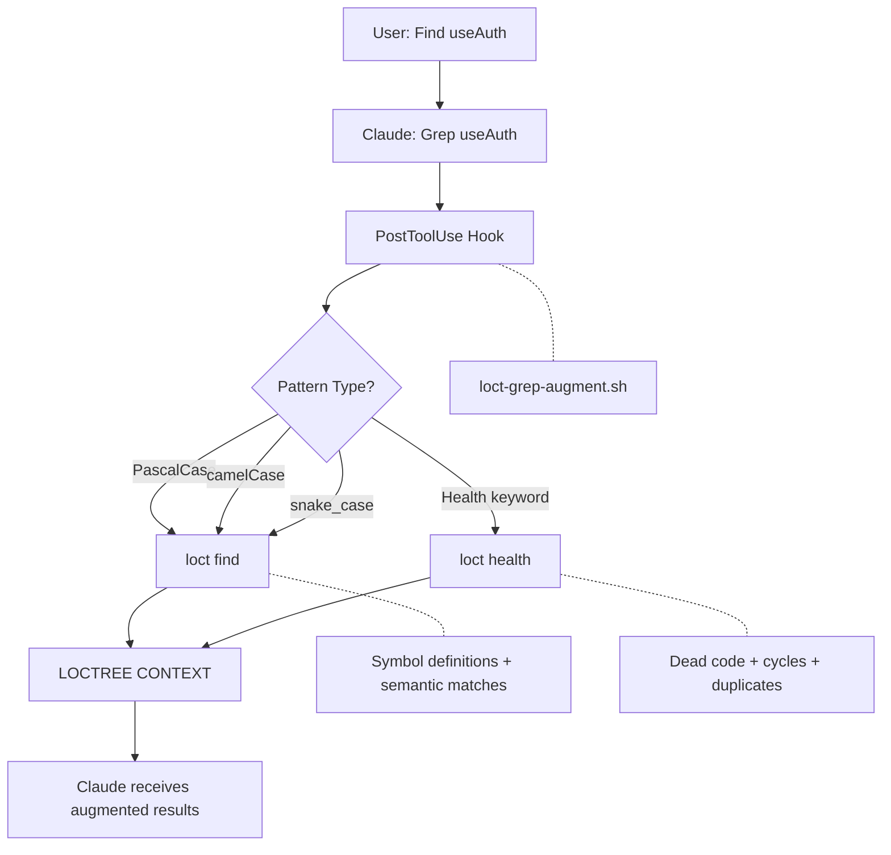

# ⌜ Loctree ⌟

**Semantic code intelligence for Claude Code.**
**When Claude searches, loctree understands.**

## Overview

Loctree automatically augments Claude Code's search results with semantic context. No manual commands needed — just search normally and receive symbol definitions, dependency graphs, dead code status, and impact analysis alongside your grep results.

<p align="center">
  
</p>

> **Status:** v1.0.0 — Production release with Grep, Read, and Edit hooks.

## The Problem

Claude Code's built-in search tools find **text matches**. But you need **code understanding**:

- Where is `MyComponent` **defined**?
- What **imports** this file?
- What would **break** if I change this?
- Is this code **actually used**?

## The Solution

| Claude Searches | Claude Receives |
|-----------------|-----------------|
| `grep "UserService"` | 10 text matches |
| `grep "UserService"` + loctree | 10 text matches **+ symbol definitions + usages + dead code status** |

**Zero friction.** No manual commands. Just search normally.

## Features

- **Search Augmentation**: Symbol definitions, semantic matches, dead code status
- **File Context**: Dependencies and impact analysis when reading files
- **Edit Warnings**: Alerts when modifying high-impact files (10+ consumers)
- **Smart Pattern Recognition**: PascalCase, camelCase, snake_case, React hooks
- **Multi-term Search**: `useAuth|useSession` finds both symbols
- **Auto-caching**: First search creates snapshot (~15s), subsequent searches use cache (~0.3s)
- **Live Logging**: All hook activity logged to `~/.claude/logs/loct-hook.log`

## Tech Stack

| Component | Technology | Purpose |
|-----------|------------|---------|
| Core CLI | [loctree](https://loct.io) | AST-based code analysis |
| Hook System | Bash + jq | PostToolUse integration |
| Languages | TypeScript, Rust, Python, Go, Vue, Svelte | Supported codebases |
| Caching | `.loctree/` snapshot | Fast subsequent queries |

## Installation

### Prerequisites

- [loctree CLI](https://loct.io) v0.8.0+
- jq (JSON processor)
- Claude Code v1.0.0+

### 1. Install loctree CLI

```bash
cargo install loctree
# or
brew install loctree
```

### 2. Install hook scripts

```bash
# Clone the plugin
git clone https://github.com/VetCoders/loctree-plugin.git
cd loctree-plugin

# Copy hooks to Claude config
mkdir -p ~/.claude/hooks ~/.claude/logs
cp hooks/*.sh ~/.claude/hooks/
chmod +x ~/.claude/hooks/loct-*.sh
```

### 3. Configure Claude Code

Add to `~/.claude/settings.json`:

```json
{
  "hooks": {
    "PostToolUse": [
      {
        "matcher": "Grep",
        "hooks": [{ "type": "command", "command": "bash ~/.claude/hooks/loct-grep-augment.sh" }]
      },
      {
        "matcher": "Bash",
        "hooks": [{ "type": "command", "command": "bash ~/.claude/hooks/loct-grep-augment.sh --bash-filter" }]
      },
      {
        "matcher": "Read",
        "hooks": [{ "type": "command", "command": "bash ~/.claude/hooks/loct-read-context.sh" }]
      },
      {
        "matcher": "Edit",
        "hooks": [{ "type": "command", "command": "bash ~/.claude/hooks/loct-edit-warning.sh" }]
      }
    ]
  }
}
```

### 4. Verify installation

```bash
bash scripts/verify-install.sh
```

### 5. Restart Claude Code

Run `/clear` or restart the application.

## Quick Start

```bash
# Open Claude Code in your project
cd your-project

# Search for a symbol - loctree augments automatically
# (First search takes ~15s to scan, subsequent searches ~0.3s)
```

Watch the log to see what's happening:

```bash
tail -f ~/.claude/logs/loct-hook.log
```

## How It Works



### Hook Overview

| Tool | Hook | Purpose |
|------|------|---------|
| **Grep** | `loct-grep-augment.sh` | Adds semantic symbol search |
| **Bash** | `loct-grep-augment.sh --bash-filter` | Same for rg/grep commands |
| **Read** | `loct-read-context.sh` | File structure + impact |
| **Edit** | `loct-edit-warning.sh` | Critical file warnings |

### Example Output

```
LOCTREE CONTEXT
═══════════════

Symbol Matches (2):
  src/hooks/useAuth.ts:15      [DEF] export function useAuth
  src/contexts/AuthContext.tsx:42  [DEF] export const useAuth

Semantic Matches (8):
  useAuthState (0.67)  src/hooks/useAuthState.ts
  AuthProvider (0.54)  src/contexts/AuthContext.tsx

Dead Code Status: USED (imported by 7 files)
```

## CLI Reference

```bash
loct --for-ai          # AI-optimized codebase overview
loct find <symbol>     # Symbol search with semantics
loct slice <file>      # File dependencies
loct impact <file>     # What breaks if I change this?
loct health            # Dead code, cycles, duplicates
```

## Configuration

### Environment Variables

```bash
# Custom log file location
export LOCT_HOOK_LOG_FILE=~/my-custom.log

# Disable logging
export LOCT_HOOK_LOG_FILE=/dev/null
```

### Pattern Recognition

| Pattern | Detection | Action |
|---------|-----------|--------|
| `PascalCase` | Component/Class | `loct find` |
| `camelCase` | Function/Variable | `loct find` |
| `snake_case` | Rust/Python/Tauri | `loct find` |
| `A\|B` | Multi-term | Search both |
| `dead\|unused` | Health keyword | `loct health` |

## Performance

| Operation | Cold (no cache) | Warm (cached) |
|-----------|-----------------|---------------|
| `loct find` | ~15s | ~0.3s |
| `loct slice` | ~15s | ~0.2s |
| `loct impact` | ~15s | ~0.2s |
| `loct health` | ~20s | ~0.5s |

Hook overhead: **< 300ms** per augmented search.

## vs. ast-grep

| Feature | ast-grep | loctree |
|---------|----------|---------|
| Activation | Manual | **Automatic** (hook-based) |
| Learning curve | Write AST patterns | **Zero** — just grep |
| Dead code | No | **Yes** |
| Dependency graph | No | **Yes** |
| Impact analysis | No | **Yes** |

## Roadmap

### Implemented

- [x] Grep search augmentation (symbol + semantic matches)
- [x] Bash command filtering (rg/grep detection)
- [x] Read file context (slice + impact)
- [x] Edit warnings (critical file detection)
- [x] Multi-term search (`A|B` alternation)
- [x] Snake_case pattern support
- [x] Live logging (`~/.claude/logs/loct-hook.log`)
- [x] 32KB payload limit (prevents context bloat)
- [x] Auto-caching (no manual `loct scan` needed)

### Planned

- [ ] Claude Code marketplace integration
- [ ] MCP server mode (direct tool, no hooks)
- [ ] Custom pattern configuration
- [ ] Project-specific settings

## Documentation

- [Installation Guide](docs/INSTALLATION.md)
- [Quick Start](docs/QUICK_START.md)
- [Architecture](docs/ARCHITECTURE.md)
- [FAQ](docs/FAQ.md)
- [Changelog](docs/CHANGELOG.md)
- [Hook Reference](docs/HOOKS.md)

## Contributing

- [loctree-suite](https://github.com/Loctree/loctree-suite) — Core CLI and MCP server
- [Issues](https://github.com/VetCoders/loctree-plugin/issues) — Bug reports and feature requests

## License

MIT License — see [LICENSE](LICENSE)

---

**Made with (งಠ_ಠ)ง by the ⌜ Loctree ⌟ 𝖙𝖊𝖆𝖒 (c) 2026
Maciej & Monika + Klaudiusz (AI) + Mixerka (AI)**
